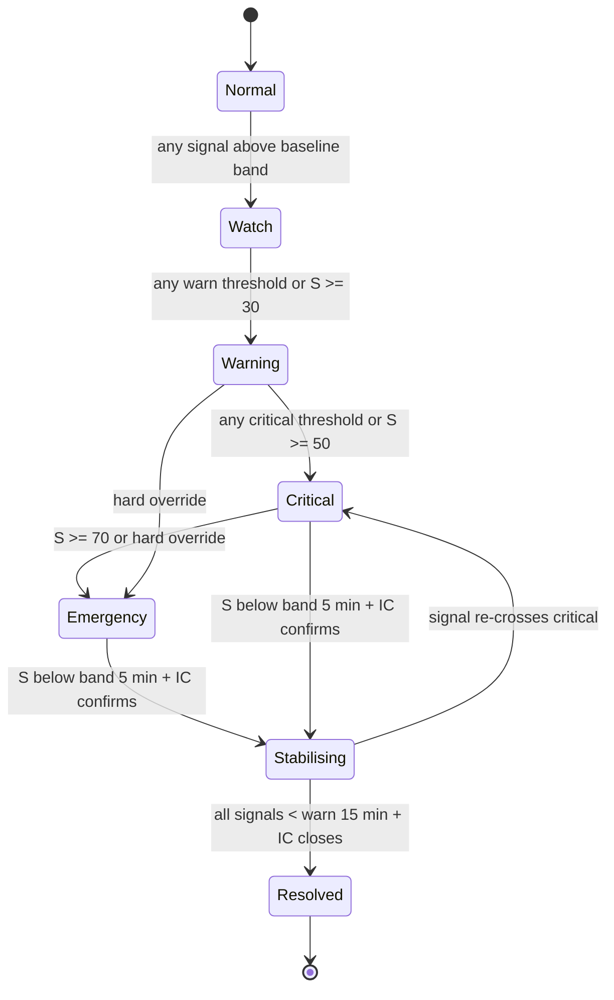

<!-- Generated from ROund2/MochaTrade Flash-Crash Scenarios & Response Spec.docx. The .docx is the source of truth; regenerate rather than hand-edit. -->

# MochaTrade Flash-Crash Scenarios & Response Spec

Sep 25, 2026 · @Mayaskara

## 1. Purpose and scope

This doc lists 18 ways a MochaTrade flash crash can unfold, ranks each by severity, and gives the software spec needed to detect, escalate, communicate and log each one in the first 60 minutes. It is the design input for Track 3 of ACM MarketSphere 2026 Round 2 (The Flash-Crash Simulation).

The brief's must-haves drive the structure:

| Brief must-have | Where it lives in this doc |
|---|---|
| Live or simulated feed of at least two signals | Section 9 (signal catalogue) |
| Alert thresholds / escalation triggers | Sections 3 and 9 (severity engine) |
| Pre-built communication templates | Section 11 |
| Running incident log incl. abnormal-liquidation decisions | Section 12 |

Judging focuses on speed and clarity under a live scenario, realism for a 3-person team, and reducing chaos rather than adding screens. Every design choice below is tested against those three.

Status of numbers. The brief prescribes no thresholds, counterparties or platforms. All figures here are prototype assumptions to be stated in the demo, not MochaTrade's production values.

## 2. Assumed MochaTrade model and its financial loose ends

A MochaTrade crash is rarely just a price move: leverage, stablecoin collateral and INR rails fail together, so the tool must watch all three. The model below is an assumption built from the brief's hints (wallet, UPI/banking rails, KYC/AML, trading engine, derivatives rules, crypto exchanges, grey-market competitors); replace it with your Round 1 model if it differs.

Assumed money flow

- Indian retail user deposits INR via UPI/bank transfer through a banking or payment partner.

- INR is converted to a USD stablecoin (USDT/USDC) and credited to a custodial MochaTrade wallet.

- The stablecoin balance is margin collateral for leveraged futures (perpetuals) and options (F&O) on global underlyings.

- MochaTrade either passes trades to an external liquidity provider or venue (A-book), or holds some risk itself (B-book), or a mix.

- Withdrawals reverse the path: stablecoin → INR → UPI/bank.

Loose ends that turn a market move into a MochaTrade crisis

| # | Loose end | What breaks in a crash | Scenarios it feeds |
|---|---|---|---|
| L1 | High leverage on retail accounts | Small moves wipe margin; liquidations cluster at similar prices and feed each other | M1, M2, M6 |
| L2 | Gap risk beyond maintenance margin | Price jumps past liquidation price; account goes negative; loss lands on the insurance fund, then on MochaTrade | M2, M3 |
| L3 | Thin insurance fund at pre-seed stage | Once drained, the only options are auto-deleveraging (ADL) of winners or eating losses from equity | M2, M3, M5 |
| L4 | Stablecoin used as both collateral and settlement asset | A depeg shrinks every account's margin at once, with no market move needed; depegs tend to coincide with crashes (wrong-way risk) | S1, S2 |
| L5 | Single price source / oracle for mark price | A stale or manipulated feed triggers liquidations the real market does not justify | M4, P1 |
| L6 | Hedge dependency on external venues/LPs | Venue outage or withdrawal freeze leaves MochaTrade's book unhedged exactly when it matters | S3 |
| L7 | Unhedged B-book or written options | MochaTrade becomes the counterparty to winning trades; short-gamma losses grow with volatility | M5, M6 |
| L8 | Liquidity mismatch in treasury | Users can withdraw instantly, but treasury sits at venues, custodians and banks with delays and limits | S4 |
| L9 | INR ↔ USDT conversion basis | Indian USDT premium and USD/INR both move in stress; deposits and withdrawals get mispriced | S5 |
| L10 | Bank/UPI partner risk | Banks may freeze or throttle crypto-linked flows during volatility; users cannot top up margin or exit | R1 |
| L11 | Regulatory grey zone (LRS/FEMA, FIU-IND registration, VDA tax and TDS) | A public blow-up invites scrutiny, blocking or partner exits | R2 |
| L12 | 3-person ops team | Key-person risk, alert fatigue, slow manual approvals | All, P3, I1 |

The regulatory entries are prompts for your Round 1 legal analysis, not legal conclusions.

## 3. Severity rubric

Severity is computed live from five impact dimensions, and a few hard overrides force SEV-1 regardless of score. SEV-1 is the worst.

| Level | Meaning | Score range | Who is paged | Customer comms |
|---|---|---|---|---|
| SEV-1 Emergency | Customer funds or platform solvency at risk; core function down | ≥ 70 | All 3 + founders + relevant partner | Status page + in-app within 15 min of confirmation |
| SEV-2 Critical | Material customer impact or fast-growing loss; functions degraded | 50–69 | All 3 | In-app banner once cause is classified |
| SEV-3 Warning | Abnormal signals, limited impact, could escalate | 30–49 | Incident Commander + owner | Optional volatility notice |
| SEV-4 Watch | Elevated but explainable activity | < 30 | Dashboard only | None |

Impact dimensions (each scored 0–5 by the engine from live signals)

| Code | Dimension | 0 looks like | 5 looks like | Weight |
|---|---|---|---|---|
| F | Customer funds at risk | No balance errors | Wrong liquidations or frozen withdrawals across many users | 0.30 |
| B | Balance-sheet loss (bad debt, unhedged P&L, insurance fund draw) | 0% of insurance fund | ≥ 50% of insurance fund used | 0.25 |
| A | Service availability (trade, close, top-up, withdraw) | All working | Users cannot close positions or add margin | 0.15 |
| V | Velocity (rate of change of the worst signal) | Flat | Worst signal doubling in < 5 min | 0.15 |
| R | Regulatory and reputational exposure | No external noise | Media, regulator or partner attention | 0.15 |

$$
S = 20 \times (0.30F + 0.25B + 0.15A + 0.15V + 0.15R)
$$

S runs 0–100. The engine recalculates every tick (simulated: every 2 s).

Hard overrides to SEV-1 (any one is enough)

- Confirmed wrongful liquidation of customer positions (liquidation anomaly ratio above critical, see Section 9)

- Insurance fund below 25% of its starting balance, or any auto-deleveraging (ADL) event

- Collateral stablecoin below $0.97 on the independent reference feed for 5+ minutes

- Users unable to close positions or add margin for 3+ minutes

- Any suspected wallet or key compromise

De-escalation rule. Severity drops one level only after the score stays below the lower band for 5 continuous minutes and the Incident Commander confirms. This hysteresis stops alerts flapping during a volatile market.

Inherent rank (for the catalogue). Each scenario also gets a static rank: Likelihood (1–5) × Impact (1–5) = 1–25, used to order the catalogue and decide which playbooks to build first.

## 4. Ranked scenario catalogue

The liquidation cascade that drains the insurance fund ranks first; build its playbook, plus M1, S1 and I1, before anything else. Roles assume a 3-person team: IC = Incident Commander (Risk/Ops/Treasury), TL = Tech Lead (Engineering), CS = Comms/Support lead.

| Rank | ID | Scenario | Likelihood (1–5) | Impact (1–5) | Inherent score | Peak SEV | Owner | Reference sheet |
|---|---|---|---|---|---|---|---|---|
| 1 | M2 | Liquidation cascade drains insurance fund → bad debt / ADL | 4 | 5 | 20 | SEV-1 | IC | Extends A |
| 2 | P2 | Matching engine / API overload: users cannot close or add margin | 4 | 4 | 16 | SEV-1 | TL | New |
| 3 | M1 | Directional flash crash, platform healthy | 5 | 3 | 15 | SEV-2 | IC | A |
| 4 | S1 | Collateral stablecoin depeg | 3 | 5 | 15 | SEV-1 | IC | B |
| 5 | M4 | Mark-price oracle stale, wrong or manipulated | 3 | 5 | 15 | SEV-1 | TL | Extends C |
| 6 | S4 | Withdrawal run exceeds hot wallet + INR float | 3 | 5 | 15 | SEV-1 | IC | New |
| 7 | M3 | Price gap past liquidation price → negative balances | 3 | 4 | 12 | SEV-2 | IC | New |
| 8 | S3 | Hedge venue / liquidity provider outage or freeze | 3 | 4 | 12 | SEV-2 | IC | New |
| 9 | R1 | UPI / banking partner freezes or throttles flows | 3 | 4 | 12 | SEV-2 | IC | New |
| 10 | P1 | Liquidation / risk engine bug | 2 | 5 | 10 | SEV-1 | TL | C |
| 11 | I1 | Customer panic / information cascade | 5 | 2 | 10 | SEV-3 | CS | D |
| 12 | M6 | Concentrated (whale) position unwind | 3 | 3 | 9 | SEV-2 | IC | New |
| 13 | S2 | Stablecoin chain congestion, issuer freeze or blacklist | 3 | 3 | 9 | SEV-2 | IC | Extends B |
| 14 | I2 | Insolvency rumour / impersonation scams | 3 | 3 | 9 | SEV-2 | CS | Extends D |
| 15 | M5 | Options volatility spike: short-gamma loss | 2 | 4 | 8 | SEV-2 | IC | New |
| 16 | R2 | Regulatory action or access blocking mid-event | 2 | 4 | 8 | SEV-1 | IC | New |
| 17 | S5 | INR ↔ USDT basis blowout | 3 | 2 | 6 | SEV-3 | IC | New |
| 18 | P3 | Hot wallet / key compromise during chaos | 1 | 5 | 5 | SEV-1 | TL | New |

Low inherent score does not mean low severity when it happens: P1, R2 and P3 are rare but go straight to SEV-1 through the hard overrides in Section 3.

## 5. Playbooks: market and liquidation

Each playbook gives the trigger, why it costs MochaTrade money, the actions in order, the decisions that must be logged, and the exit condition. Signal codes refer to Section 9.

### M1 — Directional flash crash, platform healthy (peak SEV-2)

- Situation: Underlying falls fast (e.g. −5% to −15% in minutes). Liquidations rise in line with the move; systems healthy.

- Why it costs money: Mostly customer losses, not MochaTrade's. Risk is escalation into M2 or P2, plus ticket surge (I1).

- Triggers: PX_CHG_5M ≤ −5% (warn), ≤ −10% (critical); LIQ_RATE > 100/min (warn), > 300/min (critical); LAR stays 0.7–1.5 (market-explained).

- Actions: (1) IC acknowledges. (2) TL confirms feed and engine health. (3) IC checks LAR to confirm liquidations are market-driven. (4) IC considers protective controls: cap leverage on new positions (e.g. 10x → 3x), raise initial margin. (5) CS publishes volatility notice. (6) Watch insurance fund and ticket rate.

- Log: Cause classification (market vs system), any leverage/margin change with reason.

- Exit: PX_CHG_5M > −2% and LIQ_RATE < 50/min for 10 min.

### M2 — Liquidation cascade drains insurance fund (peak SEV-1)

- Situation: Liquidations push price down, triggering more liquidations. Positions close below bankruptcy price; each shortfall is paid from the insurance fund.

- Why it costs money: Once the fund is empty, losses hit MochaTrade equity or must be socialised through auto-deleveraging (ADL) of profitable users — a trust-destroying event.

- Triggers: INS_FUND_PCT < 60% (warn), < 25% (SEV-1 override); BAD_DEBT_RATE rising; ADL_COUNT > 0 (SEV-1 override).

- Actions: (1) IC declares SEV-1 and pages founders. (2) Switch affected instruments to reduce-only mode (no new exposure). (3) Raise maintenance margin or widen liquidation steps (partial liquidations) to slow the cascade. (4) IC decides whether to top up the insurance fund from treasury, and by how much. (5) If ADL is unavoidable, CS prepares ADL notice before it runs. (6) TL confirms the liquidation engine is not over-firing (rule out P1).

- Log: Reduce-only activation time, insurance top-up amount and source, ADL decision and affected-user count.

- Exit: INS_FUND_PCT stable for 15 min, BAD_DEBT_RATE = 0, reduce-only lifted with IC sign-off.

### M3 — Price gap past liquidation price (peak SEV-2)

- Situation: Underlying reopens or jumps (market-hours gap on equity/index underlyings, news shock) past many liquidation prices at once. No orderly liquidation is possible.

- Why it costs money: Accounts go negative. Retail users rarely repay negative balances, so the deficit is MochaTrade's.

- Triggers: NEG_BAL_ACCTS > 0 (warn), > 50 or sum > 5% of insurance fund (critical); single-tick move > maintenance margin percentage.

- Actions: (1) Freeze negative accounts' withdrawals pending reconciliation. (2) IC decides the negative-balance policy (absorb vs pursue). (3) Pre-set: tighten leverage on gap-prone instruments ahead of known market opens.

- Log: Total negative balance, policy chosen.

- Exit: All negative accounts reconciled and policy communicated.

### M4 — Mark-price oracle stale, wrong or manipulated (peak SEV-1)

- Situation: Mark price comes from a feed that freezes, lags, or shows a single-venue wick. Users are liquidated at prices the wider market never traded.

- Why it costs money: Wrongful liquidations become compensation liabilities and possible regulatory complaints.

- Triggers: ORACLE_DEV (mark vs median of ≥ 3 reference sources) > 0.5% (warn), > 1.5% (critical); ORACLE_AGE > 5 s (warn), > 15 s (critical).

- Actions: (1) TL switches mark price to fallback median feed. (2) IC pauses liquidations on affected instruments (logged, time-boxed: 10 min max, then re-evaluate). (3) Snapshot all liquidations since first deviation for review. (4) CS notice: "some liquidations under review".

- Log: Feed switch time, liquidation-pause start/end, list of disputed liquidations.

- Exit: Deviation < 0.3% for 10 min; review queue created for compensation.

### M5 — Options volatility spike, short-gamma loss (peak SEV-2)

Applies only if MochaTrade writes or market-makes options (B-book).

- Situation: Implied volatility jumps; options MochaTrade is short gain value faster than hedges can adjust.

- Why it costs money: Direct P&L loss that grows with every further move.

- Triggers: IV_CHG > +30% relative (warn), > +60% (critical); NET_GAMMA_PNL loss > 10% of risk capital (critical).

- Actions: Widen option quotes, move to reduce-only on short-dated options, IC orders delta hedge on external venue.

- Log: Hedge trades, quote-width changes.

- Exit: Net Greeks back inside risk limits.

### M6 — Concentrated (whale) position unwind (peak SEV-2)

- Situation: One account or linked group holds a large share of open interest; its liquidation moves price and triggers M2.

- Why it costs money: Large single liquidation can exceed available liquidity, creating bad debt in one event.

- Triggers: TOP10_OI_SHARE > 25% (warn), > 40% (critical) with that account's margin ratio < 1.2x.

- Actions: Liquidate the position in slices (not one market order), hedge externally first, alert account owner to add margin.

- Log: Slice schedule, slippage per slice.

- Exit: Position closed or margin restored.

## 6. Playbooks: stablecoin, treasury and settlement

Stablecoin stress is MochaTrade's most dangerous single loose end because the same token is collateral, settlement asset and treasury reserve.

### S1 — Collateral stablecoin depeg (peak SEV-1)

- Situation: USDT or USDC trades below $1 on major venues. If MochaTrade values collateral at market, every account loses margin at once and liquidations fire with no move in the underlying. If it values collateral at $1, MochaTrade carries the gap itself.

- Why it costs money: Wrong-way risk: depegs tend to happen during crashes, so margin shrinks when positions are already losing. Treasury held in that coin is also marked down.

- Triggers: STBL_PX (median of ≥ 3 independent sources) < $0.995 (watch), < $0.985 (warn), < $0.97 for 5 min (SEV-1 override). Confirm against a second source before acting (reference sheet step 1).

- Actions: (1) IC confirms depeg on independent sources, not only MochaTrade's own order book. (2) Apply a collateral haircut policy chosen in advance (e.g. value at $1 until $0.98, then at a smoothed 30-min average, never at the instantaneous low). (3) Pause new deposits in the affected coin. (4) Offer conversion to the alternate stablecoin if liquidity exists. (5) Rebalance treasury away from the coin within pre-set limits. (6) CS asset-specific notice. (7) Notify issuer/custody partner only if MochaTrade's flows are implicated.

- Log: Price sources used, haircut method and time applied, treasury rebalances.

- Exit: STBL_PX ≥ $0.995 for 30 min.

### S2 — Chain congestion, issuer freeze or blacklist (peak SEV-2)

- Situation: Network fees spike and transfers stall, or the issuer freezes an address MochaTrade or a partner uses.

- Why it costs money: Treasury cannot move collateral to hedge venues; user withdrawals queue up and trigger S4.

- Triggers: CHAIN_CONF_TIME > 3x baseline (warn); SETTLE_FAIL_PCT > 2% (warn), > 10% (critical); any frozen MochaTrade address (SEV-1).

- Actions: Switch to an alternate network for the same coin if supported; batch withdrawals; communicate expected delays per network.

- Log: Affected networks, queue size, switch decisions.

- Exit: Confirmation times and failure rate back to baseline; queue cleared.

### S3 — Hedge venue or liquidity provider outage (peak SEV-2)

- Situation: The external venue or LP MochaTrade routes to goes down, rejects orders, freezes withdrawals, or widens spreads sharply.

- Why it costs money: MochaTrade's book becomes unhedged: user wins are paid from MochaTrade's pocket. Collateral parked at the venue may be stuck (counterparty risk).

- Triggers: LP_REJECT_PCT > 5% (warn), > 20% (critical); LP_SPREAD_BPS > 3x baseline; NET_EXPOSURE_USD > risk limit.

- Actions: (1) Fail over to backup venue. (2) Set instruments to reduce-only until hedge restored. (3) IC tracks unhedged exposure every minute. (4) Notify LP through the direct ops channel.

- Log: Failover time, peak unhedged exposure.

- Exit: Net exposure inside limit and primary or backup venue stable for 15 min.

### S4 — Withdrawal run exceeds liquid treasury (peak SEV-1)

- Situation: Panic (I1/I2) drives withdrawals faster than the hot wallet and INR float can pay. Most assets are at venues, custodians or in transit.

- Why it costs money: Not an accounting loss at first, but delayed withdrawals look like insolvency and accelerate the run.

- Triggers: WDR_QUEUE_USD / HOT_LIQ_USD > 50% (warn), > 90% (critical); WDR_RATE > 5x baseline.

- Actions: (1) IC pulls funds from cold storage and venues per pre-signed plan. (2) Process withdrawals in order, no discretionary freezes. (3) Publish a factual queue-time estimate. (4) If proof-of-reserves exists, point to it.

- Log: Top-ups, queue depth over time, any withdrawal limits applied and why.

- Exit: Queue clears within normal processing time for 30 min.

### S5 — INR ↔ USDT basis blowout (peak SEV-3)

- Situation: Indian USDT premium or USD/INR moves sharply; MochaTrade's quoted conversion rate is stale.

- Why it costs money: Users arbitrage stale rates; MochaTrade absorbs the spread.

- Triggers: INR_BASIS_PCT (MochaTrade rate vs reference) > 1% (warn), > 3% (critical).

- Actions: Re-quote from live source, widen conversion spread, cap per-user conversion size temporarily.

- Log: Rate changes and caps.

- Exit: Basis < 0.5% for 15 min.

## 7. Playbooks: platform, rails, regulatory and information

### P1 — Liquidation or risk engine bug (peak SEV-1)

- Situation: Market is calm or moderately down, but MochaTrade liquidates far more than the move explains (bad margin calc, wrong leverage tier, unit bug).

- Why it costs money: Every wrongful liquidation is a compensation claim; confirmed bugs are the fastest route to regulator and press attention.

- Triggers: LAR (observed ÷ expected liquidations) > 2.0 (warn), > 3.0 with PX_CHG_5M better than −3% (SEV-1 override). ENGINE_ERR_RATE > 1%.

- Actions: (1) Treat as platform incident; TL takes lead. (2) IC pauses liquidations (time-boxed, re-evaluated every 10 min, since pausing also grows bad-debt risk). (3) Preserve logs and timestamps (evidence). (4) Decide on reduce-only or full trading halt. (5) CS communicates only confirmed facts.

- Log: Liquidation pause decision with rationale, evidence snapshot ID, affected accounts list.

- Exit: Fix deployed or engine rolled back, LAR 0.7–1.5 for 15 min, compensation review opened.

### P2 — Matching engine / API overload (peak SEV-1)

- Situation: Crash traffic (10–50x normal) overwhelms order entry. Users cannot close positions or add margin while being liquidated.

- Why it costs money: Users liquidated while unable to act have a strong fairness claim; this is the classic exchange-outage complaint.

- Triggers: ORDER_LATENCY_P95 > 1 s (warn), > 5 s (critical); API_ERR_PCT > 2% (warn), > 10% (critical); "cannot close" for 3 min (SEV-1 override).

- Actions: (1) TL sheds non-essential load (charts, new sign-ups, non-trading APIs). (2) Prioritise close-position and add-margin requests. (3) IC pauses liquidations for accounts with failed close/margin requests in the window. (4) CS status page "degraded performance".

- Log: Degradation window start/end, liquidations executed during degradation (for review).

- Exit: Latency and errors back under warn for 10 min.

### P3 — Hot wallet or key compromise (peak SEV-1)

- Situation: Attackers exploit the chaos (ops distracted, many withdrawals) to drain a hot wallet or abuse an admin account.

- Triggers: HOT_WALLET_OUTFLOW to unknown addresses > limit; withdrawal to address never seen before above size threshold; admin login from new device during incident.

- Actions: Freeze hot-wallet signing, rotate keys, contact custody partner and stablecoin issuer (freeze request), preserve evidence.

- Log: Freeze time, amounts, addresses.

- Exit: Keys rotated, loss quantified, founders and partners briefed.

### R1 — UPI / banking partner freezes or throttles (peak SEV-2)

- Situation: Bank or payment aggregator pauses crypto-linked flows during volatility or after a flagged pattern.

- Why it costs money: Users cannot deposit margin (more liquidations) or withdraw INR (feeds S4 and I2).

- Triggers: UPI_FAIL_PCT > 5% (warn), > 25% (critical); partner notice.

- Actions: Switch to backup rail if contracted, show clear in-app notice on deposit/withdraw screens, direct ops call with partner, consider liquidation grace for users with failed deposits.

- Log: Partner contact, rail switch, affected-user count.

- Exit: Success rate > 98% for 30 min.

### R2 — Regulatory action or access blocking (peak SEV-1)

- Situation: A visible blow-up triggers a regulator query, app-store or URL blocking, or a partner exiting under regulatory pressure.

- Actions: Founders own this, not the 3-person ops team. The tool's job: flag it, freeze public comms to approved statements only, preserve full incident record.

- Log: Notice received, who was informed, statements approved.

### I1 — Customer panic / information cascade (peak SEV-3)

- Situation: Ticket and social volume explode; systems may be fine.

- Triggers: TICKET_RATE > 3x baseline (warn), > 8x (critical); SENTIMENT < −0.4 (warn); top repeated question detected.

- Actions: Confirm facts, publish one clear update, give Support a canned FAQ, pin answer to top-3 questions, escalate if tickets reveal a real fault (e.g. many "can't withdraw" → check S4/R1).

- Log: Messages sent, top ticket themes.

- Exit: Ticket rate < 2x baseline.

### I2 — Insolvency rumour or impersonation scams (peak SEV-2)

- Situation: Social posts claim MochaTrade is insolvent, or fake "MochaTrade support" accounts ask users for credentials or transfers.

- Why it costs money: Rumours cause S4 runs; scams cause user losses blamed on MochaTrade.

- Triggers: RUMOR_MENTIONS (keywords: insolvent, exit scam, withdrawals frozen) > threshold; reports of fake handles.

- Actions: Factual rebuttal only with evidence (reserve figures if available); in-app warning "we will never DM you for OTP or transfers"; report impersonator accounts.

- Log: Rebuttals posted, accounts reported.

- Exit: Rumour mentions declining for 30 min.

## 8. Compound scenarios

Real crashes chain several scenarios, so the simulator should run these scripted chains, not single scenarios in isolation. Chain C1 is the recommended live demo because it shows every must-have and ends in de-escalation.

| Chain | Sequence (minute markers) | Peak SEV | What it tests in the tool |
|---|---|---|---|
| C1 "Black Tuesday" (demo) | M1 at T+0 → I1 at T+6 → M2 at T+14 (insurance fund to 40%) → reduce-only at T+18 → recovery from T+35 → resolved T+55 | SEV-1 | All must-haves; hysteresis; ADL decision avoided by early reduce-only |
| C2 "Depeg spiral" | S1 at T+0 → collateral haircut triggers liquidations (M2-like) → I2 insolvency rumours → S4 withdrawal run | SEV-1 | Wrong-way risk; stablecoin logic distinct from price logic |
| C3 "Is it us or the market?" | Mild market dip (−2%) + LAR = 3.5 → P1 | SEV-1 | Classifier separating market vs system cause |
| C4 "Can't get out" | M1 → P2 overload → liquidations during degradation → R1 UPI failures stop margin top-ups | SEV-1 | Fairness decisions: liquidation pause for affected users |
| C5 "Naked book" | M1 → S3 LP outage → net exposure breach → M5 if options book exists | SEV-2 | Treasury/risk view, not just customer view |
| C6 "Bad actor" | M1 + I1 → P3 unusual hot-wallet outflow during withdrawal surge | SEV-1 | Security override beats everything else in priority |

Priority rule when scenarios overlap. The engine shows one incident with several active scenario tags, not several incidents. Actions are ordered: security (P3) → customer funds integrity (P1, M4, S1) → solvency (M2, M3, S3, S4) → availability (P2, R1) → communication (I1, I2).

## 9. Build spec: signals, severity engine, state machine

The prototype needs one simulated feed generator, one rules engine, and one screen; everything below is sized for that. Show only the 4–6 signals relevant to the active scenario tags, with the rest collapsed, so the screen reduces chaos.

### 9.1 Signal catalogue (simulated)

| Code | Signal | Unit | Baseline | Warn | Critical | Scenarios |
|---|---|---|---|---|---|---|
| PX_CHG_5M | Underlying price change, 5-min | % | ±0.5 | ≤ −5 | ≤ −10 | M1, M3 |
| LIQ_RATE | Liquidations | per min | 5 | > 100 | > 300 | M1, M2 |
| LAR | Liquidation anomaly ratio (below) | ratio | 1.0 | > 2.0 | > 3.0 | P1, M4 |
| INS_FUND_PCT | Insurance fund vs start | % | 100 | < 60 | < 25 | M2, M3 |
| BAD_DEBT_RATE | Shortfall paid from fund | USD/min | 0 | > 0 | > 2% of fund/min | M2 |
| ADL_COUNT | Auto-deleverage events | count | 0 | — | > 0 | M2 |
| NEG_BAL_ACCTS | Accounts below zero | count | 0 | > 0 | > 50 | M3 |
| ORACLE_DEV | Mark vs median reference | % | < 0.1 | > 0.5 | > 1.5 | M4 |
| ORACLE_AGE | Seconds since last mark update | s | 1 | > 5 | > 15 | M4 |
| STBL_PX | Collateral stablecoin median price | USD | 1.000 | < 0.985 | < 0.97 (5 min) | S1 |
| SETTLE_FAIL_PCT | Failed on-chain settlements | % | < 0.5 | > 2 | > 10 | S2 |
| LP_REJECT_PCT | Hedge orders rejected | % | < 1 | > 5 | > 20 | S3 |
| NET_EXPOSURE_USD | Unhedged net position | % of limit | < 30 | > 70 | > 100 | S3, M5 |
| WDR_QUEUE_RATIO | Withdrawal queue ÷ hot liquidity | % | < 10 | > 50 | > 90 | S4 |
| INR_BASIS_PCT | Conversion rate vs reference | % | < 0.3 | > 1 | > 3 | S5 |
| ORDER_LATENCY_P95 | Order entry latency | ms | 80 | > 1,000 | > 5,000 | P2 |
| API_ERR_PCT | API error rate | % | < 0.5 | > 2 | > 10 | P2 |
| UPI_FAIL_PCT | Failed UPI deposits/withdrawals | % | < 2 | > 5 | > 25 | R1 |
| TICKET_RATE | Support tickets | × baseline | 1 | > 3 | > 8 | I1 |
| SENTIMENT | Social sentiment score | −1 to +1 | 0.1 | < −0.4 | < −0.7 | I1, I2 |

The brief needs at least two signals; LIQ_RATE and TICKET_RATE are the minimum, and adding LAR, INS_FUND_PCT and STBL_PX is what makes the tool MochaTrade-specific.

### 9.2 Market-vs-system classifier

The single most useful decision the tool makes is whether liquidations are explained by the market. It compares observed liquidations with a simple expectation from the price move and account leverage.

$$
LAR = \frac{L_{obs}}{L_{exp}}, \quad L_{exp} = N_{open} \times P(\text{liq} \mid \Delta p) \,/\, \text{window}
$$

Here N_open is the number of open leveraged positions and P(liq | Δp) is the share of positions whose liquidation price lies within the observed move, read from the simulated leverage distribution. In the prototype, precompute a lookup table of Δp (0% to −20%) → expected share liquidated.

| Condition | Classification | Default scenario tag |
|---|---|---|
| LAR 0.7–1.5 and price move large | Market-driven | M1 / M2 |
| LAR > 2.0 and price move small | System-driven | P1 |
| LAR high and ORACLE_DEV high | Pricing-driven | M4 |
| LAR high and STBL_PX < 0.985 | Collateral-driven | S1 |
| Tickets/sentiment high, all else normal | Information-driven | I1 / I2 |

### 9.3 Incident state machine

Every transition writes a log entry automatically. Upward transitions are automatic; downward ones need IC confirmation.

### 9.4 Protective controls the tool can propose

The tool proposes; a human approves; the log records who and why. Nothing below fires automatically.

| Control | Reduces | Cost / trade-off | Typical scenarios |
|---|---|---|---|
| Lower max leverage on new positions | Future cascade size | Revenue, user complaints | M1, M2 |
| Reduce-only mode per instrument | New exposure, hedge gap | Users cannot open trades | M2, S3, P1 |
| Raise maintenance margin / partial liquidation | Cascade speed | More margin calls | M2, M6 |
| Pause liquidations (time-boxed) | Wrongful liquidations | Bad debt grows while paused | M4, P1, P2 |
| Switch to fallback price feed | Bad marks | Slight lag | M4 |
| Collateral haircut policy | Treasury gap in depeg | Some users liquidated | S1 |
| Pause deposits in one asset | Toxic inflows | Users cannot top up in that coin | S1, S2 |
| Insurance fund top-up | ADL risk | Uses company capital | M2, M3 |
| Load shedding | Engine overload | Non-core features offline | P2 |
| Freeze hot-wallet signing | Theft | All withdrawals stop | P3 |

### 9.5 Minimal architecture

- Simulator: scripted scenario timelines (JSON) emitting all signals every 2 s, with a speed control (1x, 5x, 10x) so 60 minutes can be demoed in about 8.

- Rules engine: thresholds, score S, overrides, classifier, state machine.

- UI: one screen with four zones — severity banner + timer; active signals; next-action checklist with suggested template; incident log.

- Operator controls: acknowledge, approve/skip action, approve/edit/send template, add note, change severity (with reason).

## 10. 60-minute runbook for a 3-person team

Each person has one job per phase, and the tool shows each role only its own next action. This is the core of the "realism for a 3-person team" judging criterion.

| Phase | IC (Risk/Ops/Treasury) | TL (Engineering) | CS (Comms/Support) | Tool behaviour |
|---|---|---|---|---|
| 0–10 min Detect | Acknowledge alert (target < 2 min); read classifier result; set initial SEV | Check feed freshness, engine errors, latency | Open ticket dashboard; hold all public comms | Start incident timer; auto-log trigger; show classifier verdict |
| 10–20 min Escalate | Choose protective controls (Section 9.4); page founders if SEV-1 | Rule in or out P1, P2, M4 | Approve first customer notice (in-app + status page); send FAQ to support queue | Propose playbook checklist for active tags; pre-fill template with live numbers |
| 20–40 min Contain | Watch insurance fund, net exposure, stablecoin; decide top-up / ADL / haircut | Fix or roll back; load-shed if needed | Update every 15–20 min even if nothing changed; partner notice if a dependency is involved | Remind when an update is overdue; flag time-boxed controls due for review |
| 40–60 min Stabilise | Confirm de-escalation (hysteresis); lift reduce-only / liquidation pause | Verify recovery metrics; preserve evidence | Monitoring or resolution notice | Show recovery trend; require IC confirmation for each step down |
| After 60 min Close | Sign off final state; open compensation review if needed | Write technical root cause | Resolution notice; answer backlog | Generate incident summary (timeline, peaks, decisions, comms sent) |

Anti-chaos rules the tool enforces

- One incident, one screen, one owner per action.

- Maximum 3 suggested actions visible at a time.

- Repeated alerts for the same signal collapse into one card with a counter.

- Nothing is sent to customers or public without a named approver.

## 11. Communication templates

Templates are keyed by scenario tag and audience, pre-filled with live values in {braces}, and always need operator approval before sending. They state facts only: no cause is named until it is confirmed.

| ID | Audience / channel | Surfaced when | Text |
|---|---|---|---|
| T1 | Customer / in-app banner | M1 at Warning | Markets are moving sharply. {asset} is down {px_chg}% in the last {window} minutes. MochaTrade systems are operating normally. Leveraged positions carry higher liquidation risk right now; review your margin. |
| T2 | Customer / status page | Any SEV-2+ confirmed | We are investigating {issue_summary} affecting {service}. Your funds remain in your account. Next update by {next_update_time}. |
| T3 | Customer / in-app | M2 reduce-only activated | To protect all users during extreme volatility, {instrument} is in reduce-only mode: you can close or reduce positions but not open new ones. We will lift this once conditions stabilise. |
| T4 | Customer / in-app + email | M4 or P1 liquidation pause | We have paused liquidations on {instrument} while we verify pricing. Liquidations between {t_start} and {t_end} are under review, and affected users will be contacted directly. |
| T5 | Customer / asset notice | S1 depeg | {stablecoin} is trading below its usual $1 value on major markets. Deposits in {stablecoin} are paused. Collateral is valued using {haircut_method}. Other assets are unaffected. |
| T6 | Customer / withdrawal screen | S4, S2, R1 | Withdrawals are taking longer than usual (current estimate {eta}). Requests are processed in order; no action is needed from you. |
| T7 | Customer / security | I2 or P3 | MochaTrade will never ask for your password, OTP, or a transfer through direct messages. Only trust updates on {official_channels}. |
| T8 | Internal / incident channel | Any transition | [SEV-{n}] {scenario_tags} — {one_line_state}. Owner: {role}. Needed now: {action}. Dashboard: {link}. |
| T9 | Partner / direct ops channel | S2, S3, R1 when dependency implicated | MochaTrade ops here. Since {t_start} we see {metric} on {your_service}. Please confirm status and ETA. Contact: {ic_name}, {phone}. |
| T10 | Public / official X account | SEV-1, after founder approval | We are aware of {issue_summary}. Our team is working on it. Updates at {status_page_url}. |
| T11 | Support / canned FAQ | I1 at Warning | Top-3 answers auto-built from ticket themes: why was I liquidated, can I withdraw, is MochaTrade safe. |
| T12 | Customer / resolution | State → Resolved | The issue affecting {service} has been resolved as of {time}. {compensation_line_if_any}. Summary: {short_summary}. |

Rule from the reference sheet, kept: a crossed threshold only surfaces a template; it never posts one on its own.

## 12. Incident log schema and demo script

Every alert, decision and message becomes one append-only log entry; the final summary is generated from these entries, so nothing is typed twice.

### 12.1 Log entry fields

| Field | Type | Example |
|---|---|---|
| ts | timestamp (sim clock) | T+14:32 |
| type | alert / transition / decision / comm / note | decision |
| sev | SEV-1 to SEV-4 | SEV-1 |
| scenario_tags | list | [M1, M2, I1] |
| actor | IC / TL / CS / system | IC |
| action | text or control ID | Reduce-only on BTC-PERP |
| rationale | text (required for decisions) | Insurance fund at 38%, falling 4%/min |
| signal_snapshot | key values at that moment | LIQ_RATE 410, INS_FUND_PCT 38, LAR 1.1 |
| liquidation_review | enum: market-explained / under review / wrongful | market-explained |
| approved_by | role, for comms and controls | IC |
| expires_at | for time-boxed controls | T+24:32 |

The liquidation_review field answers the brief's explicit ask to capture decisions on abnormal liquidations.

### 12.2 Demo script (chain C1, about 8 minutes at 8x speed)

- Start simulation; show normal baseline (all green, SEV-4 Watch hidden).

- T+0: price falls 6%; LIQ_RATE crosses 100/min → Warning; classifier says market-driven (LAR 1.1).

- IC acknowledges; tool proposes leverage cap; IC approves, logged with rationale.

- T+6: tickets 4x baseline → I1 tag added; T1 volatility banner and T11 FAQ surface; CS approves.

- T+14: LIQ_RATE 410/min, insurance fund 40% → Critical; tool proposes reduce-only; IC approves; T3 surfaces.

- Show internal escalation (T8) and explain why no partner notice (no dependency affected).

- Optional branch: toggle a stablecoin dip to show the S1 tag and T5, then revert.

- T+35: signals fall; after 5 min below band, tool asks IC to confirm step-down to Stabilising.

- T+55: all below warn for 15 min; IC resolves; T12 resolution notice.

- Show generated incident summary: timeline, peak values, decisions, messages, open items (compensation review: none needed, liquidations market-explained).

## 13. Review of the reference cheat sheet and assumptions to state

The reference cheat sheet is sound as a skeleton; its four scenarios (A–D) map to M1, S1, P1 and I1 here. It misses most of the balance-sheet risk that comes from F&O and stablecoins.

### 13.1 What to keep

- Scenarios A–D and their response steps.

- The flow: detect → acknowledge → verify → classify → select audience → surface template → approve → send → log.

- Operator approval before any message is sent.

- Labelling thresholds as prototype assumptions.

- The demo checklist (Section 12.2 follows it).

### 13.2 What to correct or add

| Issue in reference sheet | Why it matters | Fix in this doc |
|---|---|---|
| "Price move < −5%" has no time window | −5% over a day is normal; over 5 min is a crash | PX_CHG_5M (Section 9.1) |
| Liquidations as absolute count (100/300 per min) | Depends on user base size; cannot tell market from system cause | Keep counts for demo, add LAR classifier (9.2); in production normalise per 1,000 open positions |
| Only warning/critical, no severity levels | Team cannot tell a bad day from a solvency event | SEV-1 to SEV-4 with score and overrides (Section 3) |
| No insurance fund, bad debt or ADL | Main financial loss channel for a leveraged platform | M2, M3 |
| Stablecoin threshold left to "team's configured threshold" | No collateral valuation policy; ignores wrong-way risk | S1 with numeric thresholds and haircut policy |
| No hedge venue / LP counterparty risk | Unhedged book during crash | S3 |
| No withdrawal run or INR rails | Liquidity mismatch and UPI dependency are MochaTrade-specific | S4, S5, R1 |
| No oracle / mark-price failure | Main cause of wrongful liquidations | M4 |
| No "users cannot close" overload case | Most common real complaint in crashes | P2 |
| No security scenario | Attackers exploit distracted ops | P3 |
| "No public message" for 0–10 min applies to all channels | A factual in-app volatility notice can go out early and cut tickets | T1 allowed at Warning |
| No de-escalation rule | Alerts flap during volatile recovery | 5-min hysteresis + IC confirmation |
| Pausing liquidations not treated as a trade-off | Pausing reduces wrongful liquidations but grows bad debt | Time-boxed pause with expiry in the log |
| No role split for 3 people | Judging criterion is realism for a 3-person team | Section 10 |

### 13.3 Assumptions to state during the demo

- MochaTrade model: INR via UPI → USDT/USDC custodial wallet → leveraged futures and options; mixed A-book/B-book hedging.

- All thresholds, weights and baselines are simulation values, not MochaTrade production figures.

- Insurance fund exists and starts at a fixed simulated amount.

- Three roles: Incident Commander, Tech Lead, Comms/Support lead.

- Signals are simulated; real integrations (exchange feeds, ticketing, social listening) are out of scope.

- Protective controls are proposed by the tool and executed only on human approval.

- Regulatory handling (R2) is escalated to founders; the tool only flags and records it.

